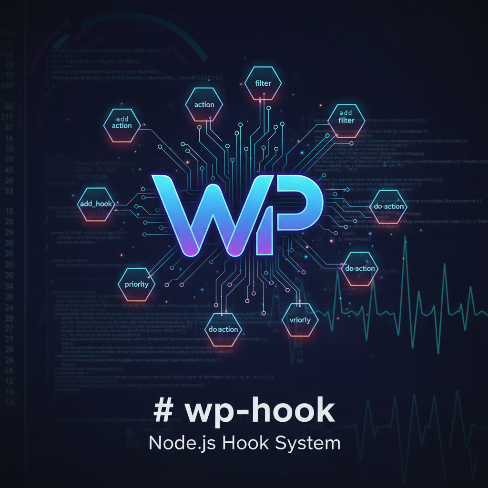

# WP-HOOK

A powerful and flexible **hook system** for **Node.js**, inspired by the **WordPress actions and filters** API. This package provides a simple yet effective way to create extensible and decoupled architectures in your JavaScript applications.



[](https://github.com/mamedul/wp-hook/)
[](https://github.com/mamedul/wp-hook/blob/main/LICENSE) &nbsp;&nbsp; [](https://github.com/mamedul/wp-hook/stargazers) &nbsp;&nbsp; [](https://github.com/mamedul/wp-hook/network/members) &nbsp;&nbsp; [](https://github.com/mamedul/wp-hook/watchers) &nbsp;&nbsp; [](https://github.com/mamedul?tab=followers)
[](http://mamedul.github.io/)


_\[ It is designed to be cross-platform, supporting modern ES2015+ environments as well as vanilla JavaScript setups. \]_

## Features

*   **Full WordPress Hook API compatibility:** Implements the vast majority of WP hook functions.
    
*   **Actions (`do_action`):** Create points in your code where other functions can be executed.
    
*   **Filters (`apply_filters`):** Create points in your code where data can be modified.
    
*   **Priority-based execution:** Control the order in which callbacks are executed.
    
*   **Hook Inspection:** Check if hooks exist, how many times they've run, and what's currently running.
    
*   **Easy to use:** A simple and intuitive API.
    
*   **Zero dependencies:** Lightweight and self-contained.
    

## Installation

You can install package via-

### ✅ **npm install**

This is the **standard** way to install any Node.js package-

```bash
npm install wp-hook
```

Or-


### ✅ **Yarn install**

Yes — Yarn can install npm packages because it uses the same npm registry under the hood (equivalent to `npm install wp-hook`)-

```bash
yarn add wp-hook
```

---

### ✅ **Test**

After installation, you can run tests from the terminal using-

```bash
npm test
```

## Quick Start

### ✅ NodeJS

```js
const {add_action, do_action, did_action,  add_filter, apply_filters, current_action} = require('wp-hook');
const wp_hook = require('wp-hook');

// --- ACTIONS ---
// 1. Register a function for an action hook
function myActionCallback(arg1, arg2) {
    console.log(`Action running! Args: ${arg1}, ${arg2}`);
    console.log(`Currently doing action: ${wp_hook.current_action()}`);
}
wp_hook.add_action('app_init', myActionCallback, 10, 2);

// 2. Trigger the action hook
console.log('Doing action...');
wp_hook.do_action('app_init', 'user_id_123', { setting: 'on' });
console.log(`'app_init' has run ${wp_hook.did_action('app_init')} time(s).`);


// --- FILTERS ---
// 1. Register a function for a filter hook
function myFilterCallback(text) {
    return text.toUpperCase();
}
wp_hook.add_filter('format_title', myFilterCallback);

// 2. Trigger the filter hook and use the modified value
let title = 'Hello World';
title = wp_hook.apply_filters('format_title', title);
console.log(title); // Output: HELLO WORLD
```

***OR***


### ✅ Browser Usage (UMD)

This library can be used directly in the browser. A UMD (Universal Module Definition) bundle is provided in the `dist` folder, which is also available via CDN.

#### 1\. Include via CDN

You can add `wp-hook` to your project by including the following script tag. It's recommended to use the minified version for production.

```html
<!-- Regular -->
<script src="https://cdn.jsdelivr.net/npm/wp-hook/dist/wp-hook.umd.js"></script>

<!-- Minified -->
<script src="https://cdn.jsdelivr.net/npm/wp-hook/dist/wp-hook.umd.min.js"></script>
```

#### 2\. Example Usage

Once included, the library will be available under the global variable `Wp_Hook`.

```html
<!DOCTYPE html>
<html>
<head>
    <title>wp-hook Browser Example</title>
</head>
<body>
    <h1>Check the console for output!</h1>

    <script src="https://cdn.jsdelivr.net/npm/wp-hook/dist/wp-hook.umd.min.js"></script>

    <script>
        // The library is now available on the window.Wp_Hook object
        console.log(Wp_Hook);

        // Add an action
        Wp_Hook.add_action('app_loaded', function() {
            console.log('The application has loaded!');
        });

        // Trigger the action
        Wp_Hook.do_action('app_loaded');
        // Console Output: The application has loaded!

        // Use a filter
        const originalText = "hello browser";
        const filteredText = Wp_Hook.apply_filters('format_text', originalText, (text) => text.toUpperCase());
        
        console.log(filteredText); 
        // Note: Filters require a callback to be added first to have an effect.
        // Let's add one now.
        Wp_Hook.add_filter('format_text', (text) => text.toUpperCase());
        const trulyFilteredText = Wp_Hook.apply_filters('format_text', originalText);
        console.log(trulyFilteredText);
        // Console Output: HELLO BROWSER
    </script>
</body>
</html>
```

---

## Preview


### ✅ NodeJS

```bash
node test.php
```

**OR**

### ✅ Browser  (UMD)

[▶ Open Live Preview](https://mamedul.ddns.net/wp-hook/browser-test.html)


---

## API Reference

### 1\. Registering Hooks

| Function | Purpose |
| --- | --- |
| `add_action(hook, callback, priority, args)` | Attach a function to an action hook. |
| `add_filter(hook, callback, priority, args)` | Attach a function to a filter hook. |

### 2\. Triggering Hooks

| Function | Purpose |
| --- | --- |
| `do_action(hook, ...args)` | Trigger an action hook (run all attached callbacks). |
| `do_action_ref_array(hook, args_array)` | Same as `do_action()`, but pass arguments as an array. |
| `apply_filters(hook, value, ...args)` | Trigger a filter hook, passing `$value` through each callback. |
| `apply_filters_ref_array(hook, args_array)` | Same as `apply_filters()`, but arguments are passed as an array. |

### 3\. Removing Hooks

| Function | Purpose |
| --- | --- |
| `remove_action(hook, callback, priority)` | Remove a previously added action callback. |
| `remove_filter(hook, callback, priority)` | Remove a previously added filter callback. |
| `remove_all_actions(hook, priority)` | Remove all callbacks for a specific action hook (or priority). |
| `remove_all_filters(hook, priority)` | Remove all callbacks for a specific filter hook (or priority). |

### 4\. Inspecting Hooks

| Function | Purpose |
| --- | --- |
| `has_action(hook, callback = false)` | Check if a function is hooked to an action (or if any callbacks exist). |
| `has_filter(hook, callback = false)` | Check if a function is hooked to a filter (or if any callbacks exist). |
| `did_action(hook)` | Returns how many times an action has run. |
| `current_action()` | Get the name of the currently running action hook. |
| `current_filter()` | Get the name of the currently running filter hook. |
| `doing_action(hook = null)` | Check if a specific action (or any action) is currently running. |
| `doing_filter(hook = null)` | Check if a specific filter (or any filter) is currently running. |

## Advanced Usage

### ✅ Custom Instances

While the singleton is convenient, you can create isolated instances of the `Wp_Hook` class for separate event buses.

```js
const myInstance = new Wp_Hook();

myInstance.add_action('my_hook', () => console.log('Hello from my instance!'));

myInstance.do_action('my_hook');
```


## Files

Files structures/ tree

```bash
wp-hook/
├── lib/
│   └── Wp-Hook.js
│   └── Hook.js
├── dist/
│   └── wp-hook.umd.js
│   └── wp-hook.umd.min.js
├── test.js
├── browser-test.html
├── package.json
├── README.md
└── CHANGELOG.md
```

## License

This extensible codes is licensed under the **MIT License**. Copyright (c) 2025 by [**Mamedul Islam**](https://mamedul.github.io/).

See the [LICENSE](https://opensource.org/licenses/MIT) file for more details.

---

## Show Your Support

If you find this extension useful, please consider giving it a star on GitHub! Your support helps motivate further development and improvements.

[](https://github.com/mamedul/wp-hook/stargazers) &nbsp;

If you found this project helpful, give it a ⭐ on GitHub!

## Author & Hire Me

This extensible codes was created by [**Mamedul Islam**](https://mamedul.github.io/) and opened for [contribute](CONTRIBUTE.md).


As a passionate **web developer** with experience in creating interactive and user-friendly web components. Currently *available for freelance projects* or full-time opportunities.

Helping businesses grow their online presence with custom web solutions. Specializing in **WordPress**, **WooCommerce**, and **Shopify**. Building modern, responsive, and high-performance scalable websites with custom made plugins, codes, customizations.

<p align="center">
  <a href="https://mamedul.github.io" title="Portfolio"></a>
  <a href="https://wa.me/8801847406830?text=Hi%2C%20do%20you%20have%20time%20to%20develop%20or%20update%20my%20website%3F" title="WhatsApp"></a>
  <a href="https://www.fiverr.com/mamedul" title="Fiverr"></a>
  <a href="https://www.linkedin.com/in/mamedul/" title="LinkedIn"></a>
  <a href="https://www.x.com/mamedul" title="X (Twitter)"></a>
  <a href="https://github.com/mamedul" title="GitHub"></a>
</p>

---
